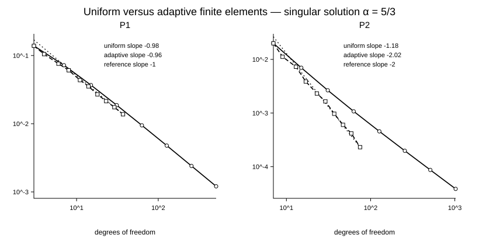
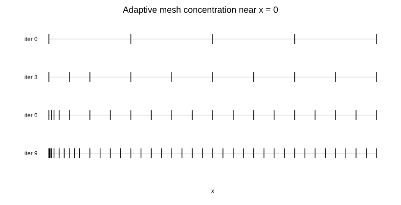
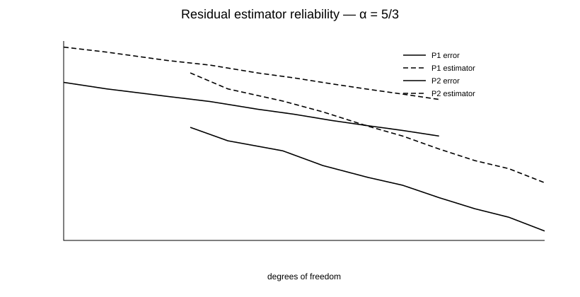

# Adaptive Finite Elements in 1D

A Python implementation of **P1 and P2 finite element methods**, residual a posteriori error estimation, and adaptive mesh refinement for a one-dimensional Poisson problem.

The project studies how limited solution regularity affects higher-order finite element convergence, and how adaptive refinement can recover the optimal rate.

## Model problem

We solve

```math
-u'' = f \quad \text{in } (0,1),
\qquad
u(0)=u(1)=0.
```

with the manufactured exact solution

```math
u_\alpha(x)=x^\alpha(1-x),
\qquad
\alpha \in \{5/3,\,10\},
```

and set $f=-u_\alpha''$.

The two values of $\alpha$ create different regularity regimes:

- `alpha = 10`: the solution is smooth, so both P1 and P2 achieve their optimal rates;
- `alpha = 5/3`: the solution belongs to $H^s(0,1)$ for $s<13/6$, but not to $H^3$. P1 retains first-order convergence in the $H^1$ seminorm, while uniform-mesh P2 is limited to a rate near $7/6$ instead of 2.

## Main numerical result

For the singular case `alpha = 5/3`, the implementation reproduces the regularity-limited behavior on uniform meshes and the recovery produced by adaptive refinement:

| Method | Mesh strategy | Fitted slope in DOF | Final test point |
| --- | --- | ---: | ---: |
| P1 | uniform | -0.98 | 511 DOF, error `1.21e-3` |
| P1 | adaptive | -0.96 | 37 DOF, error `1.37e-2` |
| P2 | uniform | **-1.18** | 1023 DOF, error `3.85e-5` |
| P2 | adaptive | **-2.02** | 75 DOF, error `2.31e-4` |

Adaptive refinement recovers the optimal $\mathrm{DOF}^{-2}$ behavior that the singularity prevents on a uniform mesh.



## Adaptive loop

The code implements the standard cycle

```text
SOLVE -> ESTIMATE -> MARK -> REFINE
```

using the residual estimator

```math
\eta_K^2
=
h_K^2\lVert f+u_h''\rVert_{L^2(K)}^2
+\frac{h_K}{2}\left(J_L^2+J_R^2\right).
```

where $J_L$ and $J_R$ are derivative jumps at the element endpoints. The largest 25% of local indicators are marked at each iteration and bisected.

For P1, $u_h''=0$ elementwise. For P2, the quadratic basis gives

```math
u_h''\big|_K
=
\frac{4}{h_K^2}
\left(u_L-2u_M+u_R\right).
```

The resulting mesh automatically concentrates points close to the singularity at $x=0$:



## Estimator reliability

The global estimator stays above the measured $H^1$-seminorm error throughout the adaptive sequence. In the singular P2 experiment, the final effectivity index is approximately

```math
\frac{\eta}{|u-u_h|_{H^1}} \approx 8.0.
```



## Implementation

The project is written in Python with NumPy and SciPy. Both finite element spaces are assembled from their local basis functions on arbitrary one-dimensional meshes:

- **P1:** linear Lagrange elements;
- **P2:** quadratic Lagrange elements with one midpoint DOF per element;
- Gaussian quadrature for load vectors, errors, and residual terms;
- sparse global stiffness matrices;
- direct sparse solution with `scipy.sparse.linalg.spsolve`;
- residual error indicators and fixed-fraction marking;
- element bisection for local refinement.

## Repository structure

```text
.
├── src/adaptive_fem/
│   ├── problem.py        # exact solution and forcing term
│   ├── fem.py            # P1/P2 assembly and finite-element solution object
│   ├── metrics.py        # H1 error and residual estimator
│   ├── adaptivity.py     # marking, bisection, adaptive loop
│   └── experiments.py    # convergence experiments
├── scripts/
│   ├── run_benchmarks.py
│   ├── run_convergence_study.py
│   ├── run_estimator_study.py
│   └── run_mesh_adaptation.py
├── tests/
│   └── test_fem.py
└── figures/
```

## Run locally

```bash
python -m venv .venv
source .venv/bin/activate      # Windows: .venv\\Scripts\\activate
pip install -e .

python scripts/run_benchmarks.py
python scripts/run_convergence_study.py
python scripts/run_estimator_study.py
python scripts/run_mesh_adaptation.py
```

Run the test suite with

```bash
python -m unittest discover -s tests -v
```

The tests check boundary conditions, error reduction under refinement, regularity-limited uniform convergence, adaptive P2 rate recovery, and estimator reliability.

## Numerical interpretation

Higher polynomial degree alone does not guarantee its nominal convergence order: the rate is constrained by solution regularity. Adaptive methods redistribute degrees of freedom toward the regions that dominate the error, allowing the higher-order approximation to recover its expected asymptotic behavior.

## License

MIT License. See [`LICENSE`](LICENSE).
